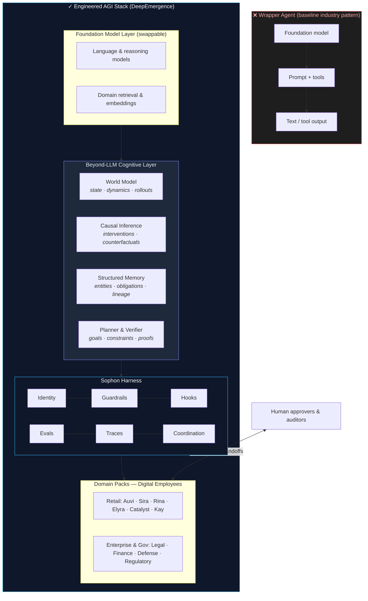
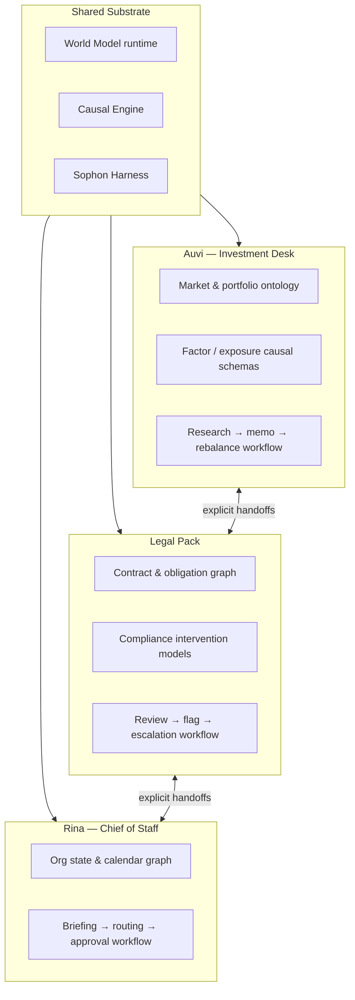
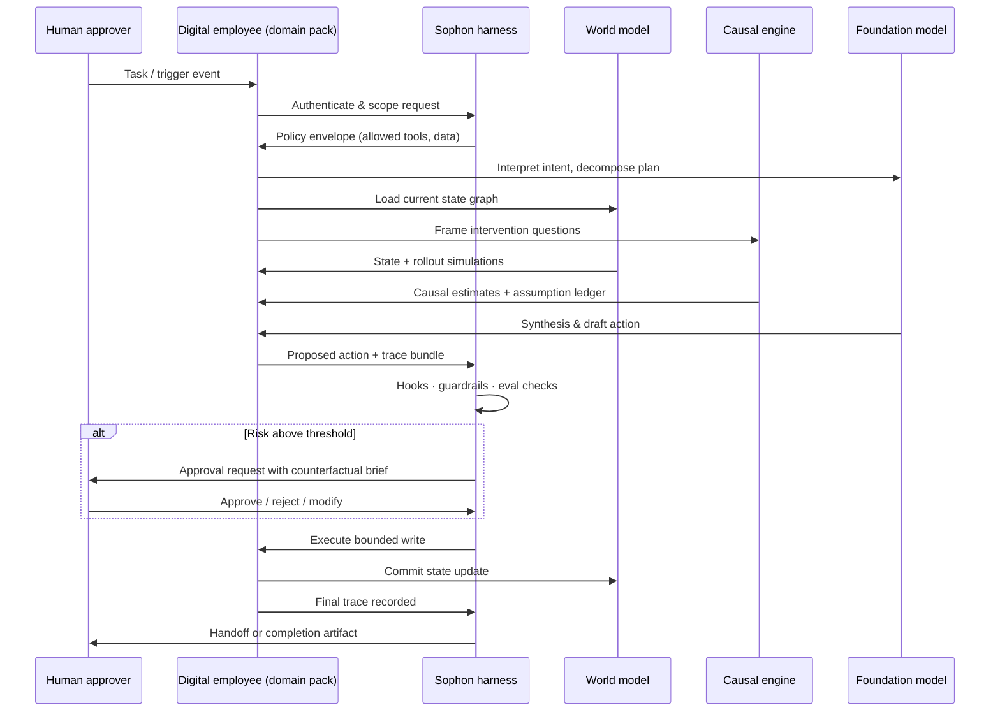
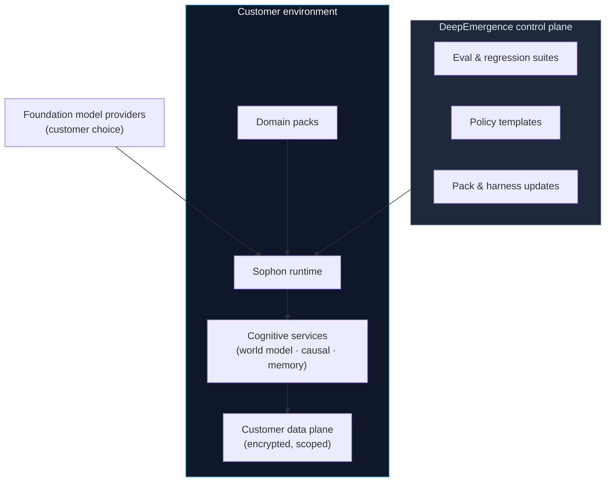

# Engineered AGI — System Architecture

**DeepEmergence · Sophon Platform**

---

## Executive Summary

Most “AI agents” today are **wrapper agents**: a foundation model, a prompt, a tool list, and session-scoped memory. They excel at language and pattern completion, but they cannot reliably **represent state**, **simulate consequences**, **reason about cause and effect**, or **operate under enforceable policy** across time.

DeepEmergence is building an **Engineered AGI solution** — not as a marketing claim about general intelligence, but as a deliberate engineering discipline. The stack combines swappable foundation models with **beyond-LLM cognitive infrastructure** (world models, causal inference, structured memory, planning), wrapped in the **Sophon harness** (identity, guardrails, evaluation, audit), and delivered as **domain packs** that behave like governed digital employees.

The model is a component. The **engineered system** is the product.

---

## Design Principles

| Principle | Implication |
|---|---|
| **Models commoditize; systems compound** | Foundation models are hot-swappable. Persistent identity, policy, traces, and domain state are not. |
| **Language is not sufficient for labor** | Real work requires prediction, intervention modeling, and verifiable action — not fluent text alone. |
| **Causality over correlation** | Decisions in finance, law, health, and policy depend on *what happens if we act*, not *what usually co-occurs*. |
| **Simulation before execution** | A world model enables dry-runs, counterfactuals, and risk scoring before irreversible writes. |
| **Governance by construction** | Autonomy is bounded at the harness boundary — deny-by-default tools, hooks, and human approval gates. |
| **Trajectory quality, not answer quality** | Evaluation grades the full decision path: retrieval → reasoning → simulation → action → handoff. |

---

## Architectural Overview

---

## Layer 1 — Foundation Models (Commoditized Intelligence)

Foundation models provide **language understanding, synthesis, and open-ended reasoning**. They are treated as **replaceable inference backends**, not as the system architecture.

**Characteristics:**
- Multi-vendor, multi-model routing by task type (research, drafting, classification)
- No pack-specific logic lives inside the model call path
- Model upgrades are harness-level migrations — eval suites catch regressions before rollout

**What this layer does *not* do:**
- Maintain durable world state
- Guarantee causal validity of conclusions
- Enforce permissions or produce audit-grade lineage on its own

---

## Layer 2 — Beyond-LLM Cognitive Infrastructure

This is the structural difference between a wrapper agent and an engineered system. Language models approximate patterns; **labor requires structured cognition**.

### 2.1 World Model

A **world model** maintains a machine-readable representation of relevant state and can **simulate forward** under candidate actions.

| Capability | Function |
|---|---|
| **State graph** | Entities, relationships, obligations, positions, and temporal facts for a domain |
| **Dynamics** | How state evolves under actions, external events, and time |
| **Rollout engine** | Short-horizon simulation of plans before execution |
| **Uncertainty** | Confidence bands and known-unknown flags surfaced to the harness |

**Example (investment desk):** Before recommending a rebalance, the system simulates portfolio exposure, liquidity constraints, and tax-lot implications — not merely retrieves similar past memos.

**Example (legal pack):** Before flagging a contract clause, the system models obligation propagation across entities and downstream compliance triggers.

### 2.2 Causal Inference Engine

A **causal layer** answers intervention questions: *If we do X, what changes?* and *Would Y have happened without X?* — distinct from correlational retrieval.

| Capability | Function |
|---|---|
| **Causal graph construction** | Domain schemas + learned/refined DAGs over variables of interest |
| **Intervention analysis** | Estimate effects of actions under stated assumptions |
| **Counterfactual reasoning** | Support “what-if” and accountability queries |
| **Assumption ledger** | Every causal claim carries explicit premises — auditable, not hidden in prose |

Causal inference is especially critical in **regulated and high-stakes domains** where correlation-driven suggestions create liability: policy change analysis, credit decisions, clinical pathways, rules-of-engagement support.

### 2.3 Structured Memory & Knowledge Lineage

Beyond vector RAG, the system maintains **typed, versioned memory**:

- Entity-centric stores (people, accounts, contracts, instruments)
- Event-sourced decision history tied to employee identity
- Provenance chains: which source, which inference step, which approval

Memory is **write-governed** — updates flow through hooks and policy, not silent context accumulation.

### 2.4 Planner & Verifier

Closing the loop between simulation and action:

1. **Goal decomposition** — break objectives into bounded sub-tasks with explicit success criteria
2. **Constraint satisfaction** — policy, regulatory, and domain rules as hard/soft constraints
3. **Verification** — pre-execution checks against world model state and causal assumptions
4. **Rollback semantics** — where possible, compensating actions are planned before writes occur

---

## Layer 3 — Sophon Harness (Governance & Orchestration)

The harness is the **operational environment** every digital employee runs inside. It is the moat: the part that compounds and survives model churn.

```mermaid
flowchart LR
    IN["Inbound task"] --> ID["Identity<br/>scoped credentials"]
    ID --> GR["Guardrails<br/>policy-as-code"]
    GR --> HK["Hooks<br/>pre/post interception"]
    HK --> AG["Agent execution<br/>model + cognitive layer"]
    AG --> EV["Evals<br/>trajectory grading"]
    EV --> TR["Traces<br/>replayable audit"]
    TR --> OUT["Handoff / write / approval"]

    style ID fill:#1e293b,stroke:#38bdf8
    style GR fill:#1e293b,stroke:#38bdf8
    style HK fill:#1e293b,stroke:#38bdf8
    style EV fill:#1e293b,stroke:#38bdf8
    style TR fill:#1e293b,stroke:#38bdf8
```

| Subsystem | Role |
|---|---|
| **Identity** | One employee, one credential scope — never a shared API key |
| **Guardrails** | Deny-by-default tool and data access, enforced at the boundary |
| **Hooks** | Intercept risky operations before they execute; inject approvals |
| **Evals** | Grade full trajectories; regressions become harness fixes, not prompt patches |
| **Traces** | Every tool call, simulation, approval, and handoff is a replayable artifact |
| **Coordination** | Multi-employee workflows with explicit delegation and accountability |

---

## Layer 4 — Domain Packs (Digital Employees)

Domain packs plug into the full stack. They inherit governance; they supply **domain ontology, causal schemas, world-model templates, and workflow playbooks**.

Each employee **owns a workflow end-to-end**: assemble information, reason (language + causal + simulation), propose action, obtain approval, execute write, log trace.

---

## End-to-End Decision Flow

This flow is the operational definition of **engineered autonomy**: the system reasons, simulates, and proposes — but **policy, causality assumptions, and approvals remain inspectable**.

---

## Wrapper Agents vs. Engineered AGI

| Dimension | Wrapper Agent | Engineered AGI (DeepEmergence) |
|---|---|---|
| **Core unit** | Chat session | Persistent digital employee |
| **Intelligence** | LLM only | LLM + world model + causal engine + planner |
| **Memory** | Context window / ad-hoc RAG | Typed, governed, lineage-tracked state |
| **Reasoning** | Correlational pattern matching | Intervention-aware causal analysis |
| **Before action** | Generate text or call tool | Simulate, verify, score risk |
| **Governance** | Prompt instructions | Policy-as-code, hooks, deny-by-default |
| **Evaluation** | Final answer quality | Full trajectory grading |
| **Audit** | Opaque logs | Replayable traces with assumption ledger |
| **Multi-agent** | Ad-hoc orchestration | Identity-scoped handoffs with accountability |
| **Model upgrades** | Silent behavior drift | Harness eval gates before rollout |

---

## Why “Engineered AGI” — Without the Hype

We use **Engineered AGI** to describe a **systems goal**, not a capability headline:

- **Engineered** — explicit layers, interfaces, evals, and governance; built to ship in production
- **AGI** — general-purpose *labor substrate* that accepts domain packs across retail and institutional workflows, not a claim that a single model is conscious or omniscient

The path to trustworthy general-purpose autonomous work runs through **world models, causal inference, and governed orchestration** — not through a larger context window on a chat wrapper.

---

## Deployment Topology

**Retail:** Hosted Sophon runtime with per-employee isolation.  
**Enterprise & government:** On-prem or private cloud; compliance lineage as a first-class product surface.

---

## Compounding Value

Value accrues in layers that **do not deprecate** when the next foundation model releases:

1. **Causal schemas and world-model state** — domain intelligence that deepens with use  
2. **Harness policy and eval history** — institutional memory of what safe execution looks like  
3. **Trace archive** — replayable audit and training signal for trajectory improvement  
4. **Cross-pack coordination graph** — organizational workflow capital  

Wrapper agents rent model intelligence for a session. An engineered stack **owns the state, the causality, and the lineage** underneath every action.

---

*DeepEmergence · contact@deepemergence.com · deepemergence.com*
