# DeepEmergence

### The engineering stack behind digital employees

 

**One harness. Any domain. Governed autonomy.**

 

Ajay Pratap Singh · Aman Pratap Singh — San Francisco / Remote

---
layout: default
---

# The shift nobody priced in yet

Two years of AI startups optimized the wrong layer.

<b>2024</b> 
Retrieval — find and summarize the right document.

<b>2025</b> 
Reasoning — analyze, reconcile, diagnose across a workflow.

<b>2026</b> 
Multiplayer + governance — agents that represent labor need permissions, audit, and coordination across parties.

 

The prompt was never the moat. The **harness around the model** is.

---
layout: default
---

# The problem

### What most "AI agents" actually are

- A chat wrapper on a foundation model
- A prompt, a tool list, and hope
- No memory of what happened last time
- No enforceable boundary on what it's allowed to touch
- Breaks silently when the model changes

### What real autonomous labor requires

- Persistent identity across sessions
- Scoped, deny-by-default write access
- A record of every decision, replayable
- Coordination across humans, agents, and other agents
- Portability across models as they improve

 

Model intelligence commoditizes fast. **The engineering discipline around it does not.**

---
layout: default
---

# Our thesis

Nobody has systematically built the <b>engineering stack</b> that turns raw model
intelligence into dependable, general-purpose labor —

the identity, guardrail, evaluation, and audit layer that has to exist
<b>before</b> autonomous systems can be trusted with real work, in any domain,
without a human re-reading every output.

 

We built that layer. We call it Sophon.

---
layout: default
---

# What we built: Sophon

A **harness** — the operational environment every digital employee runs inside.
Built as one integrated layer: identity, policy, evaluation, and audit from day one.

<b>Identity</b> 
One employee, one scoped credential — never a shared API key.

<b>Guardrails</b> 
Policy-as-code. Deny-by-default tool access, enforced at the boundary.

<b>Hooks</b> 
Pre/post-action interception. Risky calls blocked before they execute.

<b>Evals</b> 
Trajectory grading, not final-answer grading. Every regression is a harness fix.

<b>Traces</b> 
Every tool call, approval, and handoff is a replayable, auditable artifact.

 

Domain packs plug into this layer. They inherit governance instead of rebuilding it.

---
layout: default
---

# Engineered AGI — not a wrapper

A systems discipline, not a model claim. Language models approximate patterns;
<b>labor requires structured cognition under policy.</b>

### Wrapper agent

- LLM + prompt + tool list
- Session-scoped, correlational RAG
- No simulation before action
- Governance lives in the prompt
- Silent drift when the model changes

### Engineered stack

- LLM + **world model + causal inference**
- Typed, governed, lineage-tracked state
- Rollout & counterfactual before writes
- Policy-as-code at the harness boundary
- Eval-gated model upgrades

---
layout: default
---

# The full stack

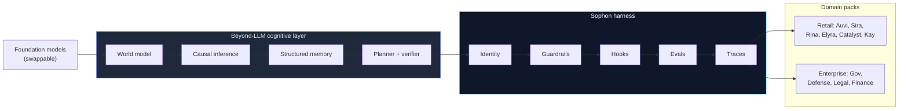

The model is a component. The **engineered system** — cognition, harness, and lineage — is the product.

---
layout: default
---

# How a decision runs

Simulate and reason **before** any irreversible write.

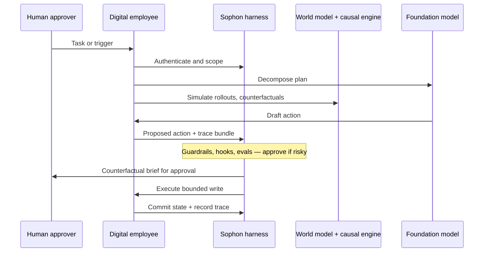

Every causal claim carries an **assumption ledger** — auditable, not buried in prose.

---
layout: default
---

# One product per domain, one substrate underneath

Each employee owns a workflow end-to-end — assemble information, reason over
it, execute the write, log the trace.

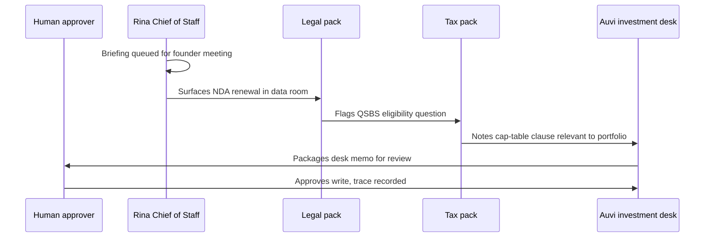

This is the difference between a **chatbot per task** and **employees that hand off work** —
the same way a real team does.

---
layout: default
---

# Retail — live and shipping

Personal army of digital employees. Same harness, six domains, real people paying for depth.

| Employee | Domain | Role | Status |
|---|---|---|---|
| **Auvi** | Investment | Digital family office — desk depth | 🟢 Live |
| **Sira** | Investment | Markets intelligence — pocket depth | 🟢 Live |
| **Rina** | Operations | AI Chief of Staff | 🟡 Early access |
| **Elyra** | Health | Healthspan COO | ⚪ Coming soon |
| **Catalyst** | Career | Career growth operator | ⚪ Coming soon |
| **Kay** | Network | Relationship operator | ⚪ Coming soon |

 

Investment is the only vertical fully covered today — capital markets depth first.
Tax, insurance, and household finance remain deliberate next packs: **depth before breadth**.

---
layout: default
---

# Enterprise & government — same harness, deeper stakes

<b>Government</b> Regulatory affairs officer — legislation diffing, briefing routing.

<b>Defense</b> Mission intelligence analyst — feed fusion, ROE-bounded execution support.

<b>Healthcare systems</b> Payer operations officer — prior auth, claims coordination.

<b>Legal</b> Contract & compliance counsel — obligation graphs, regulator diffing.

<b>Finance (enterprise)</b> Treasury & credit operator — entity reconciliation, close packages.

<b>Industrials</b> Field & supply ops chief — maintenance dispatch, vendor routing.

 

Same identity model, same guardrails, same audit trail — each new domain is a pack on the existing substrate.

---
layout: default
---

# Where the value compounds

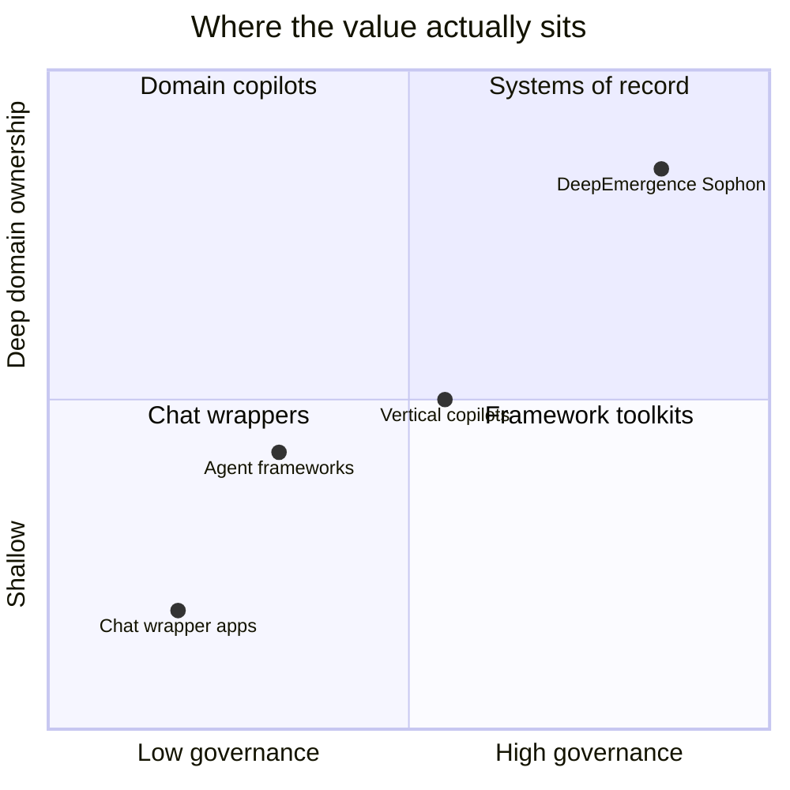

Wrappers rent a model's intelligence for a session. We own the **identity, policy,
and audit lineage** underneath every domain pack — the part that compounds and
does not get commoditized by the next model release.

---
layout: default
---

# Our right to win

Why this category accumulates to us — not the next wrapper with a bigger context window.

<b>Harness-first, not retrofitted</b> 
Identity, guardrails, evals, and traces shipped as one integrated layer from day one. Competitors bolt governance onto chat wrappers; we run inside it.

<b>Beyond-LLM in the execution path</b> 
World models, causal inference, and governed state are not roadmap items — they sit between reasoning and every irreversible write.

<b>Compounding operational moat</b> 
Trace archives, eval regressions, guardrail history, and cross-pack handoffs deepen with every customer hour. The next model release does not reset this.

<b>Founder-market fit</b> 
Institutional finance operator (Premji Invest, Goldman, YC) plus agent-systems researcher (UMD). Domain depth and harness engineering from the same founding team.

<b>Proof in market, path to institutional</b> 
Auvi and Sira live with paying users. Retail proves the harness; every audit trail unlocks the regulated verticals next.

<b>Platform economics</b> 
One Sophon runtime, many domain packs. Each new employee is incremental margin on shared cognition, policy, and infrastructure.

 

We are not racing to the best prompt. We are building the **system of record for governed machine labor**.

---
layout: default
---

# Business model

<b>Retail today</b> 
Per-employee subscription — headcount pricing aligned to AI labor. Free tier → paid by fleet size and parallel task capacity.

<b>Enterprise tomorrow</b> 
Domain pack licensing on Sophon runtime. On-prem, private cloud, or hosted. Audit lineage as a first-class product surface.

The harness is the platform. Every new pack is incremental margin on the same substrate.

---
layout: default
---

# Business model evolution

Revenue mix shifts from retail proof to institutional platform — margin expands as packs share one runtime.

Stage

ARR

Retail

Enterprise

Gross margin

Primary motion

Y0 · 2025

$0.5M

98%

2%

55%

Auvi + Sira live

Y1 · 2026

$4M

85%

15%

62%

Fleet upsell + design partners

Y2 · 2027

$12M

70%

30%

68%

Vertical depth + LOIs

Y3 · 2028

$28M

50%

50%

72%

Enterprise pack sales

Y4 · 2029

$52M

38%

62%

76%

Institutional + channel

Y5 · 2030

$85M

35%

65%

78%

Platform economics at scale

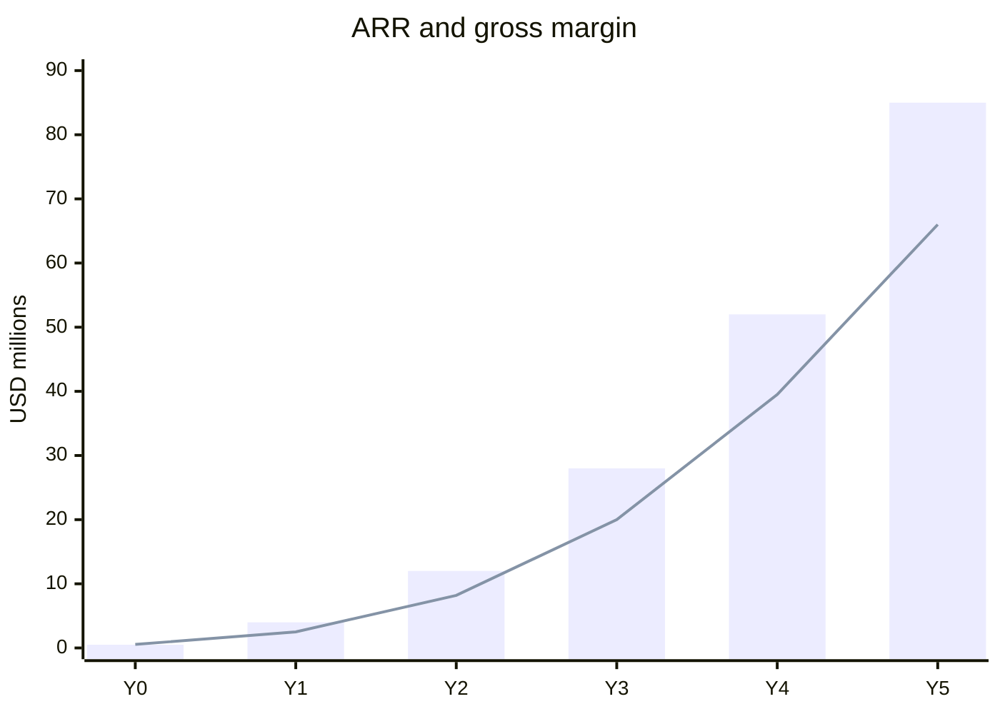

Bars = ARR · Line = gross profit (approx.)

---
layout: default
---

# Path to profitability

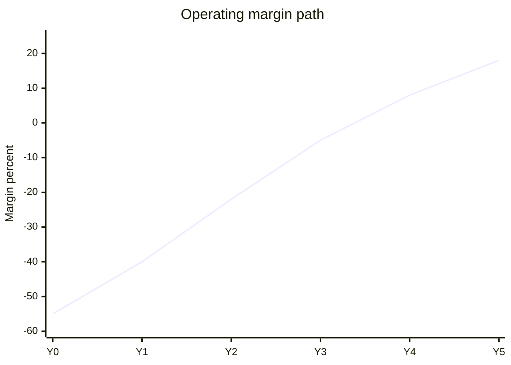

EBITDA breakeven target: <b>Y4</b> · Cash-flow positive: <b>Y5</b>

<b>Y0–Y1 · Invest in substrate</b> 
Negative margin by design — Sophon, world model, eval infra. Credits offset compute burn.

<b>Y2–Y3 · Margin inflection</b> 
Enterprise packs lift ACV 10–50x vs retail seat. Shared runtime means each pack is mostly margin.

<b>Y4–Y5 · Platform economics</b> 
65%+ revenue from enterprise. Trace and policy lineage become renewal moat — NRR target 125%+.

Unit economics: retail CAC payback &lt;6 mo · enterprise ACV $250K–$2M · LTV/CAC &gt;5x at scale

---
layout: default
---

# Investor milestones and exit path

Round

Timing

Raise

Milestone gate

Investor liquidity path

Seed

2026

$5M

6 retail packs live · $4M ARR · SOC 2 Type I

Platform proof — not an exit

Series A

2027

$15–20M

$12M ARR · 3 enterprise packs in prod · NRR &gt;110%

Secondary window opens for seed

Series B

2029

$40–60M

$50M+ ARR · gov/defense pilots · EBITDA+

Primary exit window — strategic interest

Growth / IPO path

2030+

Optional

$85M+ ARR · category leader in governed labor

IPO or strategic M&A ($500M–$1B+)

<b>Likely acquirers</b> 
Cloud platforms, enterprise software, systems of record seeking AI labor layer

<b>Seed return scenario</b> 
Series B strategic at $500M+ → 25–40x · IPO path → 50x+ at $85M ARR scale

<b>Why now</b> 
Category forming — first mover with production harness + audit lineage wins the substrate

---
layout: default
---

# Team evolution

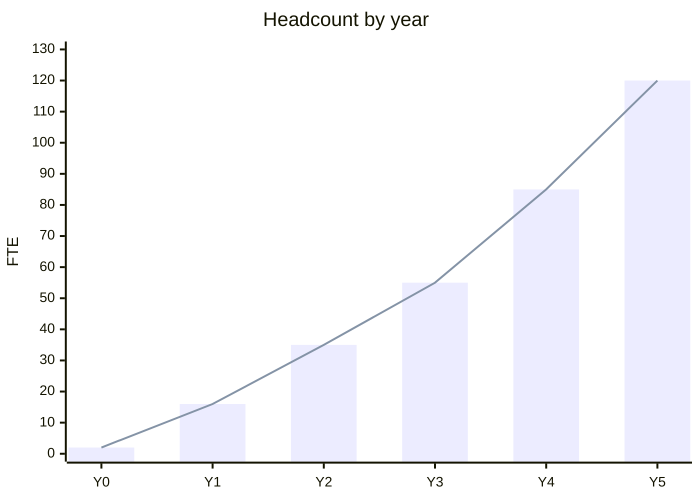

Year

FTE

Team composition

Y0

2

Founders

Y1

16

Eng 10 · Product 3 · GTM 3

Y2

35

+ML research 5 · Enterprise 8

Y3

55

+Sales 12 · CS 5 · Compliance 4

Y4

85

+Gov sales 8 · Partner 6

Y5

120

Platform 40 · Packs 35 · GTM 45

Avg fully-loaded cost ~$185K (Y1) → ~$165K (Y5) as mix shifts to non-US hubs

---
layout: default
---

# Product, research, and launches

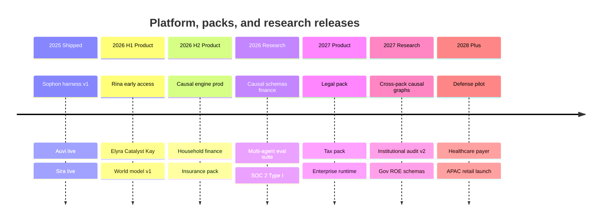

<b>Product rhythm</b> 
2–3 retail packs per year · 1 enterprise vertical per year after Y2

<b>Research rhythm</b> 
World model + causal engine major release annually · eval suite continuous

<b>Platform rhythm</b> 
Sophon major version yearly · compliance cert every 12–18 months

---
layout: default
---

# GTM evolution

<b>Phase 1 · Y0–Y1</b> 
Founder-led, product-led growth
<ul class="mt-2 opacity-80 space-y-1">
<li>YC + finance community distribution</li>
<li>Investment Twitter/Reddit, founder networks</li>
<li>Free tier → paid fleet conversion</li>
<li>Content: desk memos, audit-grade research demos</li>
</ul>

Target: 25K paid seats · $4M ARR

<b>Phase 2 · Y2–Y3</b> 
Vertical depth + design partners
<ul class="mt-2 opacity-80 space-y-1">
<li>Vertical influencers and newsletter partnerships</li>
<li>3–5 enterprise design partners per vertical</li>
<li>SOC 2 + case studies unlock regulated buyers</li>
<li>Self-serve → sales-assist for fleet accounts</li>
</ul>

Target: 120K seats · $28M ARR

<b>Phase 3 · Y4–Y5</b> 
Enterprise platform + channel
<ul class="mt-2 opacity-80 space-y-1">
<li>Enterprise AE team + solution engineers</li>
<li>SI and cloud marketplace (AWS/GCP/Azure)</li>
<li>Government and defense RFP pipeline</li>
<li>Partner-built packs on Sophon runtime</li>
</ul>

Target: 550K seats · $85M ARR

GTM spend: 9% of seed · scales to 22% of revenue by Y3 · CAC efficiency improves as harness proof compounds

---
layout: default
---

# Market opportunity

TAM
$8.4T

SAM
$156B

SOM
$85M
Yr-5 ARR

<b>TAM</b> — global knowledge-work labor spend addressable by digital employees

<b>SAM</b> — governed AI labor software, 2030 serviceable

<b>SOM</b> — Year-5 ARR beachhead capture

Geography

TAM

SAM ’30

SOM (Yr-5)

North America

$3.1T

$62B

$40M

Europe

$2.2T

$41B

$17M

Japan

$0.9T

$16B

$6M

India

$0.7T

$14B

$8M

Singapore

$0.12T

$7B

$5M

UAE

$0.08T

$6B

$4M

Rest of world

$1.3T

$10B

$5M

Global total

$8.4T

$156B

$85M

Sizing anchored to regional knowledge-worker labor economics and AI agent platform growth curves (IDC, Gartner). Beachhead in North America and affluent APAC; SOM assumes ~550K paid retail seats and 40 enterprise pack contracts.

---
layout: default
---

# Competitive landscape — gaps we fill

Incumbents optimize for chat, codegen, or single-vertical depth. Nobody ships <b>governed, multi-agent labor on a cross-domain substrate</b> with cognition beyond the LLM.

Capability

Chat wrappers

Agent frameworks

Workspace AI

Vertical copilots

DeepEmergence

Persistent scoped identity

—

~

~

~

✓

Policy-as-code governance

—

~

~

~

✓

Replayable audit trails

~

~

~

~

✓

Multi-agent handoffs

—

~

~

—

✓

World model before writes

—

—

—

~

✓

Causal intervention reasoning

—

—

—

~

✓

End-to-end workflow ownership

—

~

~

✓

✓

Cross-domain platform substrate

—

~

~

—

✓

Full — in production path
Partial — bolt-on or single-domain
Gap — not designed for this

---
layout: default
---

# Where incumbents stop — our white space

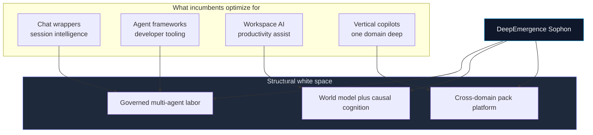

Vertical copilots win one workflow. Frameworks win developers. **We win the substrate** — identity, cognition, and audit that every domain pack inherits.

---
layout: default
---

# Roadmap

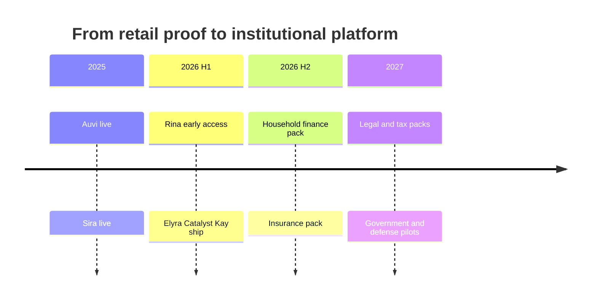

Depth first in retail. Every proof point — evals, guardrail history, audit
trail — becomes the credibility that unlocks the regulated verticals next.

---
layout: default
---

# Execution plan — 24 months

<b>Phase 1 · M1–8</b> 
Harden Sophon substrate
<ul class="mt-2 opacity-80 text-xs space-y-1">
<li>Ship Rina, Elyra, Catalyst, Kay</li>
<li>World model + causal engine in prod path</li>
<li>SOC 2 Type I kickoff</li>
<li>Team: 2 → 8 FTE</li>
</ul>

<b>Phase 2 · M9–16</b> 
Retail depth + enterprise design partners
<ul class="mt-2 opacity-80 text-xs space-y-1">
<li>Household finance + insurance packs</li>
<li>First 3 enterprise LOIs (legal, finance)</li>
<li>SOC 2 Type I complete</li>
<li>Team: 8 → 13 FTE</li>
</ul>

<b>Phase 3 · M17–24</b> 
Institutional pilots + Series A metrics
<ul class="mt-2 opacity-80 text-xs space-y-1">
<li>Legal + tax packs live</li>
<li>Government and defense pilots</li>
<li>$4M+ ARR run-rate target</li>
<li>Team: 13 → 16 FTE</li>
</ul>

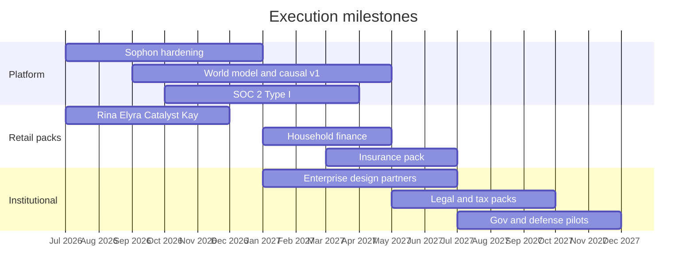

---
layout: default
---

# The ask — $5M seed

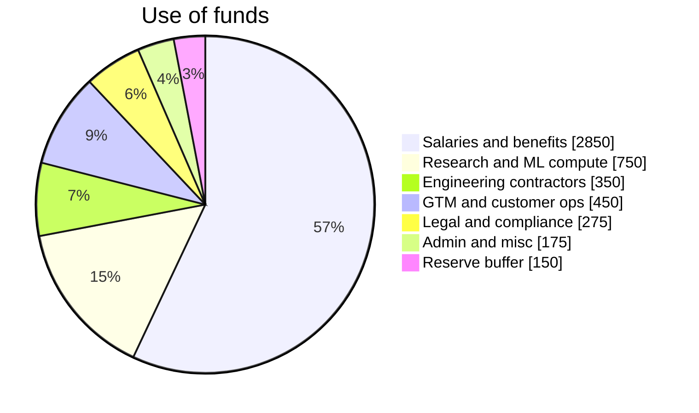

Salaries and benefits<b>$2.85M · 57%</b>

Research and ML compute<b>$750K · 15%</b>

Engineering contractors<b>$350K · 7%</b>

GTM and customer ops<b>$450K · 9%</b>

Legal and compliance<b>$275K · 5%</b>

Admin and misc<b>$175K · 4%</b>

Reserve buffer<b>$150K · 3%</b>

<b>$5M seed</b> · 24-month runway · gets us to institutional pilots and Series A metrics

---
layout: default
---

# Startup credits stack

Non-dilutive infrastructure and model credits stack on top of cash. <b>YC affiliation unlocks top tiers</b> — we apply in a deliberate sequence to maximize runway.

Cloud and GPU infrastructure

Program

Up to

Unlock

Google Cloud AI Scale

$350K

YC + AI-first

AWS Activate (YC)

$500K

YC batch

Microsoft Azure

$150K

Investor Network

NVIDIA Inception

$100K

Apply + CSP partners

Cloudflare Startups

$350K

AI tier / high growth

Modal for Startups

$25K

Seed apply

AI models and inference

Program

Up to

Unlock

Anthropic Claude Startups

$100K

VC-backed apply

OpenAI for Startups

$100K

YC / VC partner

AWS Bedrock models

incl.

Via AWS YC credits

Groq for Startups

$10K

Direct apply

Gemini / Vertex AI

incl.

Via GCP AI credits

Dev tools and platform

Program

Up to

Unlock

GitHub for Startups

$10K

YC / partner

Cursor team credits

$15K+

YC batch perk

Vercel for Startups

$30K

Direct apply

Google Workspace

1 yr

Via GCP YC bundle

NVIDIA DLI training

Free

Inception member

<b>Nominal credit universe</b> — ~$1.7M+ 
Program ceilings across cloud, models, and dev tools

<b>Realistic net value</b> — ~$1.1M 
After overlap and tier qualification · ~5 months extra runway

Published program ceilings; actual awards depend on tier, usage, and provider discretion.

---
layout: default
---

# Credits acquisition roadmap

We treat credits like a <b>capital strategy</b> — apply at seed close when tiers unlock, upgrade as traction proves consumption, and route workloads to the right provider.

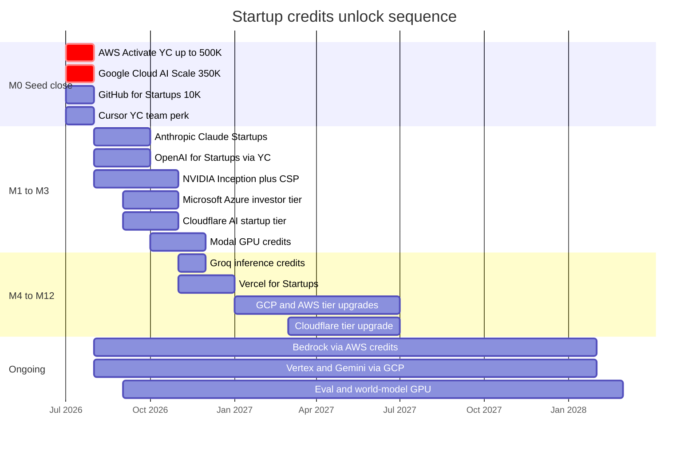

<b>1. Unlock at close</b> 
YC batch perks first — largest cloud packages before burn ramps.

<b>2. Model diversification</b> 
Anthropic + OpenAI + Bedrock — no single-vendor model lock-in.

<b>3. Workload routing</b> 
GCP for training, AWS for prod inference, Modal for batch evals, Groq for latency paths.

<b>4. Upgrade on proof</b> 
Tier increases tied to usage milestones — turns consumption into more credits.

---
layout: default
---

# Burn, credits, and runway

Monthly net burn ramps as team and compute scale ($K/mo)

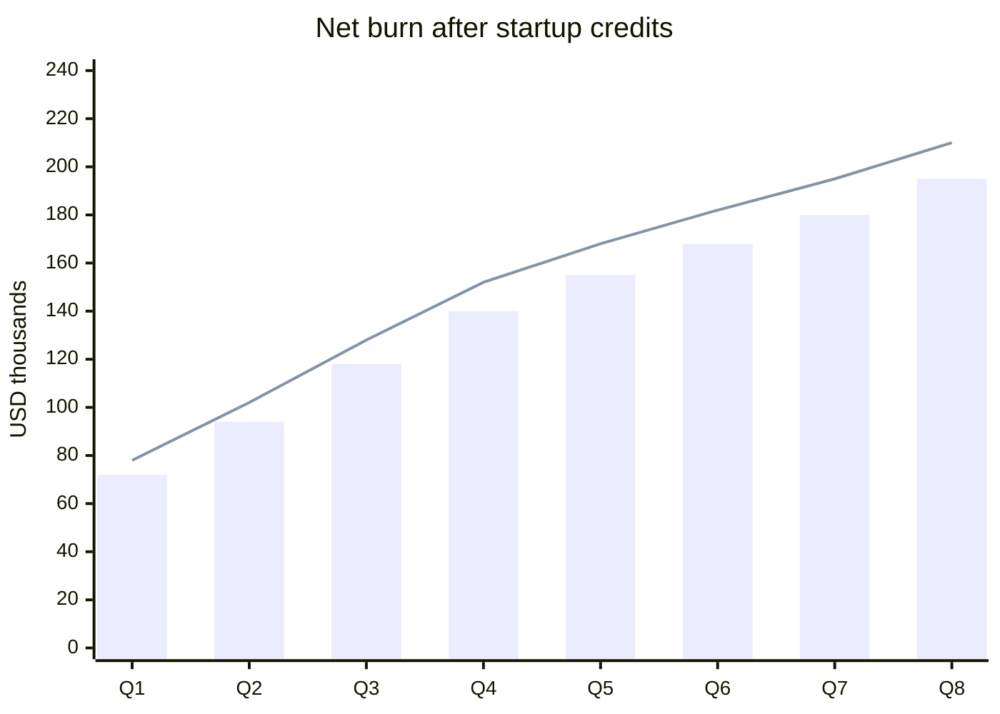

Bars = net burn after credits · Line = gross burn without credits

Cash in bank after $5M seed closes ($M)

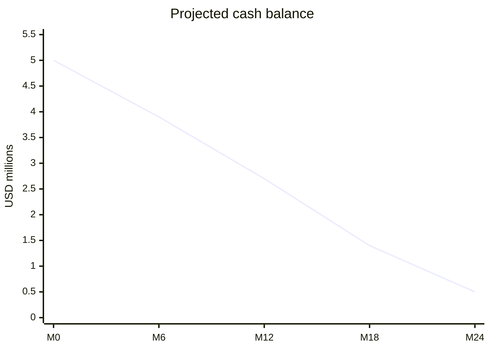

~$1.1M in credits extends effective runway by ~5 months vs cash-only plan

<b>Cloud GPU</b> 
GCP, AWS, Azure, NVIDIA, Modal 
<b class="text-blue-400">~$625K</b>

<b>Edge and deploy</b> 
Cloudflare Workers AI 
<b class="text-blue-400">~$200K</b>

<b>Model APIs</b> 
Anthropic, OpenAI, Groq, Bedrock 
<b class="text-blue-400">~$185K</b>

<b>Dev and ops</b> 
GitHub, Cursor, Vercel 
<b class="text-blue-400">~$55K</b>

<b>Total net offset</b> 
24-month realistic capture 
<b class="text-blue-400">~$1.1M</b>

Peak headcount 16 FTE · avg fully-loaded ~$185K · credits fund eval infra, world-model rollouts, and multi-model harness testing — not headcount

---
layout: default
---

# Team

### Ajay Pratap Singh
**Co-founder**

- B.Tech, **IIT Madras**
- Ex-Head of AI, **Premji Invest**
- **Y Combinator**
- **Goldman Sachs**, India

Institutional finance discipline, applied AI at family-office scale, and
startup velocity — the combination behind Auvi's audit-grade research stack.

### Aman Pratap Singh
**Co-founder**

- M.S., AI Research, **University of Maryland, College Park**

Agent systems and applied ML research — the harness engineering behind
Sophon's guardrails, evals, and trace infrastructure.

 

Building in stealth. Shipping in production.

---
layout: center
class: text-center
---

# The engineering discipline behind governed machine labor.

### We are building the layer that makes general-purpose
### autonomous work safe to run — long before anyone needs to call it AGI.

 

**contact@deepemergence.com**

deepemergence.com

