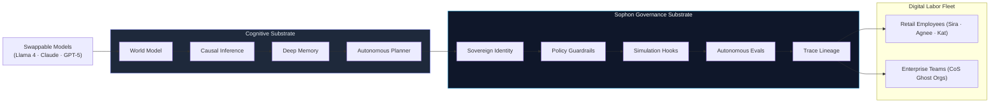
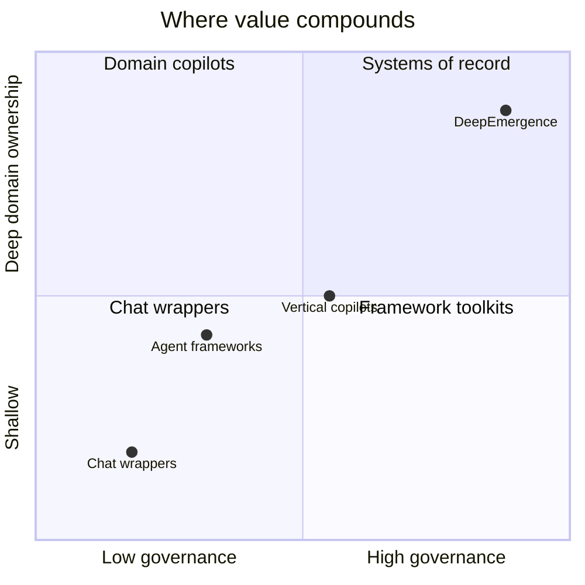
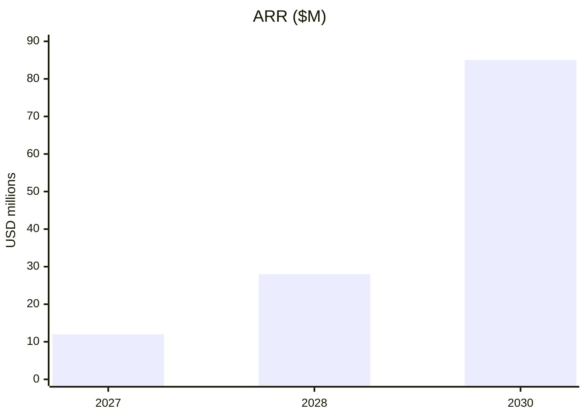

# DeepEmergence

### The engineering stack behind digital employees

**One harness. Any domain. Governed autonomy.**

Launching July 2026 · Ajay Pratap Singh · Aman Pratap Singh <a href="https://deepemergence.com" target="_blank" rel="noopener noreferrer">deepemergence.com</a> · <a href="https://www.linkedin.com/company/deepemergence" target="_blank" rel="noopener noreferrer">LinkedIn</a>

---
layout: default
class: slide-dense
---

# The problem

AI capabilities are shifting from text-retrieval tools to an ambient, deeply integrated cognitive labor economy—but the foundational infrastructure to govern, capture, and monetize this deep context does not exist.

Horizon 1 (2026–27)
Governed Labor
Sovereign digital employees · policy-as-code · multi-agent teams

Horizon 2 (2027–28)
Ambient Context
Continuous 24/7 passive mesh · wearables · smart home MCP fusion

Horizon 3 (2028+)
Cognitive Platform
Consent-gated B2B2C matching, targeting & personalization APIs

<b>Stateless Wrappers Today</b>
<ul class="deck-list">
<li>No persistent identity, audit trails, or safety sandboxes</li>
<li>Siloed data reliant on manual user input and text chat</li>
<li>No proprietary multi-channel context or continuous moats</li>
</ul>

<b>What the Future Economy Requires</b>
<ul class="deck-list">
<li><b>Governed autonomy:</b> Replayable session traces & policy hooks</li>
<li><b>Continuous enrichment:</b> Zero-friction passive biometric fusion</li>
<li><b>Platform licensing:</b> Monetizing consent-gated deep context APIs</li>
</ul>

We are not building a point-solution chat wrapper. We are building **Sophon**—the multi-phase cognitive OS designed to capture the future of digital labor and deep-context personal platforms.

---
layout: default
---

# Solution

<b>Sophon</b> — the cognitive operating system that converts swappable model intelligence into dependable, governed digital labor.

<b>Sovereign Identity</b>Enforceable credentials

<b>Dynamic Policy</b>Deny-by-default guardrails

<b>Predictive Hooks</b>Simulated safety sandbox

<b>Continuous Evals</b>Autonomic feedback loop

<b>Cryptographic Traces</b>Verifiable audit lineage

Autonomic sandboxing (simulating actions before writing) · Swappable model substrate protects against API depreciation · Upgrades are automated and eval-gated

---
layout: default
---

# Team

### Ajay Pratap Singh · Co-founder

- B.Tech, **IIT Madras** · Ex-Head of AI, **Premji Invest**
- **Y Combinator** · **Goldman Sachs**

Institutional finance and applied AI at family-office scale — domain depth for investment and regulated verticals.

### Aman Pratap Singh · Co-founder

- M.S. AI Research, **University of Maryland**

Agent systems and applied ML — harness engineering: guardrails, evals, and trace infrastructure.

Pre-revenue · Lean team through pre-seed · Scale to 16 FTE at $10–15M seed

---
layout: default
class: slide-dense
---

# Advisors

Academic, policy, and industry advisors — <b>IIT Madras</b> depth · responsible AI · institutional finance.

BR

IIT Madras

Prof. Balaraman Ravindran

HOD, Dept. of Data Science & AI · Founding Head, WSAI · RBCDSAI · CeRAI

AAAI Fellow
INAE Fellow
ACM Distinguished
Deep RL · Responsible AI
India AI Governance Guidelines
RBI FREE-AI Framework
UN AI Scientific Panel · 2026
AIGEG · TPEC

MK

Prof. Mitesh Khapra

Professor · IIT Madras

Bharat4AI
NLP · AI research
IIT Madras

VK

Prof. V. Kamakoti

Director · IIT Madras

IIT Madras
Institutional leadership
National AI policy

AR

Aravindan Raghuveer

Ex-Google DeepMind · IIT Madras

Google DeepMind
Applied ML
IIT Madras

AM

Aditya Murgai

VP · Goldman Sachs · Paytm

Goldman Sachs
Paytm
Fintech · scale

---
layout: default
---

# Market size

TAM
$8.4T

SAM
$156B

SOM
$85M

| Region | TAM | SAM | SOM Yr-5 |
| --- | ---: | ---: | ---: |
| North America | $3.1T | $62B | $40M |
| Europe | $2.2T | $41B | $17M |
| Japan | $0.9T | $16B | $6M |
| India | $0.7T | $14B | $8M |
| Singapore · UAE | $0.2T | $13B | $9M |
| **Global** | **$8.4T** | **$156B** | **$85M** |

---
layout: default
class: slide-dense
---

# Competition

Competitors sell <b>agents</b>. Buyers need <b>governed digital employees</b> they can trust with real work.

<b>vs. Chat wrappers</b> 
Identity, audit, policy — not stateless chat.

<b>vs. Agent frameworks</b> 
Sophon productized — no 12-month platform build.

<b>vs. Vertical copilots</b> 
One substrate — shared governance across packs.

<b>vs. Workspace AI</b> 
Model-agnostic · investment-grade audit · no lock-in.

Similar headlines on a landing page · <b>Different architecture under the hood</b>

---
layout: default
class: slide-dense
---

# Products

Single unified <b>Sophon</b> cognitive kernel powering domain-specialized digital labor, ambient devices, and platform licensing.

<b>Phase 1</b> · Digital employees · 2026–28

<b>Sophon Platform</b>
Governed runtime — identity, policy, evals, traces for every pack

<b>Sira</b>
Markets intelligence — research, narrative, audience & positioning

<b>Agnee</b>
AI Chief of Staff — briefings, calendar routing, executive coordination

<b>Elyra</b>
Healthspan COO — longevity habits, biomarkers, daily health ops

<b>Auvi</b>
Investment desk — portfolio research, memos, rebalance workflows

<b>Vaayoo</b>
Career operator — trajectory modeling, role & mentor matching

<b>Kat</b>
Relationships — compatibility depth, values, temperament, life path

<b>Enterprise CoS</b>
Institutional chief of staff · ghost orgs for governed teams

<b>Phase 2</b> · Data mesh & ambient devices · Q3 2027+

<b>Deeplife Wearable</b>
Passive biometrics & behavioral context — zero-friction 24/7 capture

<b>Companion Apps</b>
iOS & Android — consent-first UX, active capture, real-time Sophon sync

<b>Smart home & ambient</b>
Speakers, screens & controls via MCP — digital employees in home, car, TV, watch, phone & beyond

<b>Sophon v2 graph</b>
Sensor fusion — fuses active + passive streams into one people graph

<b>Passive data layer</b>
Continuous enrichment that Phase 3 matching precision depends on

<b>Phase 3</b> · Platform licensing · Q1 2028+

<b>Career API</b>
Vaayoo licensing — job boards, recruiters, talent platforms

<b>Dating layer</b>
Kat white-label — compatibility depth apps cannot build alone

<b>Agency graph API</b>
Sira licensing — audience psychology & campaign fit by trajectory

<b>Targeted advertising</b>
Consent-gated ads shaped by deep person context — psychology, trajectory, life stage

<b>Personalized sales & marketing</b>
Deep-context outreach — message, channel, and timing tuned to each prospect

<b>B2B2C platform</b>
Rev-share integrations wherever people psychology drives decisions

Retail fleet GA <b>Q2 2027</b> · Enterprise <b>Q3 2027</b> · Wearables & Phase 3 run in parallel from Q3 2027 / Q1 2028

---
layout: default
class: slide-dense
---

# Business model · Phase 1

Build retail digital employees and enterprise teams — three phases to a wearable-fed platform moat.

2026 H2
Sira · Agnee
<b>β</b> · free · design partners

Q2 2027
Retail sales
<b>$79–$149/mo</b> · Sira · Agnee <b>GA</b>

2028
Enterprise scale
Regulated · <b>$250K–$2M ACV</b>

Q3 2027
Enterprise sales
Ent. CoS · ghost orgs <b>β</b> · pilots

<b>Retail</b>Per-employee SaaS

<b>Enterprise</b>Packs + ghost orgs

<b>Fleet</b>Multi-employee bundles

| Year | ARR | Mix |
| --- | ---: | --- |
| 2026 | $0 | Pre-revenue |
| 2027 | $12M | 70% retail · 30% enterprise |
| 2028 | $28M | 50% / 50% |
| **2030** | **$85M** | 50% P1 · 30% P2 · 20% P3 |

Gross margin <b>78%</b> at scale

NRR target <b>125%+</b>

---
layout: default
class: slide-dense
---

# Business model · Phase 2

Launch <b>wearable devices</b>, <b>smart home hardware</b>, and <b>companion apps</b> from <b>Q3 2027</b> — passive data layer runs parallel with Phase 3 from Q1 2028.

Q3 2027
Deeplife Wearable
<b>α v0.1</b> · Phase 2 kickoff

Q4 2027
Companion Apps
<b>α</b> · iOS · Android · consent layer

Q1 2028
Wearable · Apps
<b>β v0.5</b> · passive capture · daily sync

Q2 2028
Real-time graph
Sensor fusion · <b>Sophon v2</b> · Phase 3 live

Q2 2028
Wearable · Apps
<b>GA v1.0</b> · passive data mesh

Q3 2028
Passive data layer
24/7 enrichment · zero-friction capture

Q4 2028
Graph density
Phase 2 + 3 running in parallel

<b>Wearable device</b>
<ul class="deck-list deck-list--tight">
<li>Continuous biometrics & behavioral context</li>
<li>Passive signals — no manual logging</li>
</ul>

<b>Smart home & ambient</b>
<ul class="deck-list deck-list--tight">
<li>Speakers, screens & controls via MCP</li>
<li>Employees present in home, car, TV, watch, phone</li>
</ul>

<b>Smartphone apps</b>
<ul class="deck-list deck-list--tight">
<li>iOS & Android companion · consent-first UX</li>
<li>Active capture + real-time sync to Sophon</li>
</ul>

<b>Richer data moat</b>
<ul class="deck-list deck-list--tight">
<li>Fuses active + passive streams into one graph</li>
<li>Enables Phase 3 with precision others cannot match</li>
</ul>

Phase 1 employees seed the graph · Phase 2 wearables & smart home from Q3 2027 · Phase 3 platform pilots parallel from Q1 2028

---
layout: default
class: slide-dense
---

# Business model · Phase 3

Merge intelligence into external platforms — <b>Phase 3 launches Q1 2028</b>, two quarters after Phase 2, running in parallel.

Phase 1 · 2026–27
Digital employees
Retail Q2 · Enterprise Q3 2027

Phase 2 · Q3 2027+
Wearables · apps
Passive + real-time data mesh

Phase 3 · Q1 2028+
Platform licensing
Parallel · API · rev-share

Q1 2028
Career API
<b>Vaayoo</b> pilots · Phase 3 start

Q2 2028
Dating integrations
<b>Kat</b> white-label · parallel w/ Phase 2

Q3 2028
Agency graph API
<b>Sira</b> licensing · targeting

Q4 2028
Full B2B2C scale
Rev-share · all verticals

<b>Career matching</b> · Vaayoo
<ul class="deck-list">
<li>Trajectory inference for roles & positions</li>
<li>Job boards, recruiters, talent platforms</li>
<li>Work psychology — not résumé keywords</li>
</ul>

<b>Dating & relationships</b> · Kat
<ul class="deck-list">
<li>Compatibility depth apps cannot build alone</li>
<li>Values, temperament, life trajectory</li>
<li>Consent-gated patterns → better matches</li>
</ul>

<b>Marketing agencies</b> · Sira
<ul class="deck-list">
<li>Audience from unified people psychology</li>
<li>Agency platforms tap our graph</li>
<li>Campaign fit by trajectory — not demographics</li>
</ul>

Wearable-fed graph depth · Phase 3 unlocks B2B2C reach wherever human psychology drives matching, hiring, and persuasion

---
layout: default
class: slide-dense
---

# Go-to-market & traction

Pre-revenue today · <b>Sophon Harness v0.9</b> in stealth · retail sales <b>Q2 2027</b> · enterprise <b>Q3 2027</b> · Phase 2 & 3 run in parallel from Q3 2027 / Q1 2028

Now
Sophon Harness
<b>v0.9</b> · stealth · design partners

Jul 2026
Sophon Platform
<b>v1.0</b> · waitlist · design partners

Q4 2026
Sira · Agnee
<b>β</b> · YC & finance communities

Q1 2027
Fleet <b>β</b>
Elyra · Vaayoo · Kat <b>α</b> · Ent. CoS <b>α</b>

Q2 2027
Retail sales
Sira · Agnee <b>GA</b> · paying customers

Q3 2028
Agency graph API
Sira · targeted ads

Q2 2028
Phase 2 GA · Phase 3
Wearable <b>v1.0</b> · Dating layer

Q1 2028
Phase 3 pilots
<b>Career API</b> · parallel to Phase 2

Q4 2027
Phase 2 <b>β</b>
Wearable · Apps · passive sensors

Q3 2027
Enterprise · Phase 2
Ent. sales · Wearable · Apps <b>α</b>

Retail fleet: Sira · Agnee · Elyra · Vaayoo · Kat · Auvi · Enterprise CoS — one Sophon substrate

---
layout: default
class: slide-dense
---

# Funding roadmap

Use of funds by round · ARR ramp · <b>fund · product · phase</b> milestones on one timeline

<b>Angel</b>
Q3 2026

$500K

Platform & Sophon<b>40%</b>

Founder salaries<b>30%</b>

ML compute<b>15%</b>

Legal · partners<b>15%</b>

Fund close
Sophon v1.0
Phase 1 build

<b>Pre-seed</b>
Q4 2026

$2.0M

Core team · 8 FTE<b>45%</b>

Research & compute<b>23%</b>

GTM · partners<b>15%</b>

Legal<b>10%</b>

Reserve<b>7%</b>

Fund close
Sira · Agnee β
Fleet α
Phase 1

<b>Seed</b>
Q2 2027

$12.0M

Eng · product · 16 FTE<b>40%</b>

GTM · enterprise<b>25%</b>

ML · Sophon infra<b>15%</b>

Legal · compliance<b>10%</b>

Reserve<b>10%</b>

Fund close
Retail GA
Enterprise
Phase 2 α

ARR ramp · pre-raise & targets

Q3'26

<b>$0</b>

Q4'26

<b>$0</b>

Q1'27

<b>~$0</b>

Q2'27

<b>~$400K</b>

Q3'27

<b>~$3M</b>

Q4'27

<b>~$6M</b>

EOY

<b>$12M</b>

Q3 2026
Angel · $500K
Sophon v1.0 · ~$0 ARR

Q4 2026
Pre-seed · $2M
Sira · Agnee <b>β</b> · Phase 1

Q1 2027
Fleet <b>β</b>
Elyra · Vaayoo · Kat

Q2 2027
Retail GA
Seed · $12M · ~$400K ARR

Q1 2028
Phase 3 pilots
Career API · ~$18M ARR

Q3 2027
Phase 2 <b>α</b>
Wearable · Apps · ~$3M ARR

Q3 2027
Enterprise sales
Ent. CoS · ghost orgs

EOY 2027
<b>$12M ARR</b>
70% retail · 30% ent.

Fund round close ·
Product ship ·
Phase expansion · ARR at pre-raise / run-rate

---
layout: default
class: slide-dense
---

# Burn & runway

Quarterly burn by round · capital efficiency improves as ARR offsets spend · <b>~$14.5M</b> total burn to pre-Series A

<b>Angel</b>$500K · Q3 2026

<b>$77K</b>Avg burn/mo

<b>6 mo</b>Runway

Q3'26

<b>$180K</b>

Q4'26

<b>$280K</b>

Phase 1 build & stealth

One-off cost<b>$75K (IP, Tools)</b>

Recurring/mo<b>$68K (4 FTE payroll)</b>

Credits & discounts<b>$120K (AWS, OpenAI)</b>

Sophon v1.0
Phase 1 build

<b>Pre-seed</b>$2.0M · Q4 2026

<b>$167K</b>Avg burn/mo

<b>12 mo</b>Runway

Q4'26

<b>$300K</b>

Q1'27

<b>$550K</b>

Q2'27

<b>$650K</b>

Q3'27

<b>$500K</b>

Phase 1 GA · Phase 2 R&D

One-off cost<b>$300K (DFM, Pilots)</b>

Recurring/mo<b>$142K (8 FTE, compute)</b>

Credits & discounts<b>$300K (MS Hub, GCP)</b>

Fleet β
Seed close
Retail GA

<b>Seed</b>$12.0M · Q2 2027

<b>$500K</b>Avg burn/mo

<b>24 mo</b>Runway

Q2'27

<b>$1.0M</b>

Q3'27

<b>$1.6M</b>

Q4'27

<b>$2.0M</b>

Q1'28

<b>$2.2M</b>

Phase 2 GA · Phase 3 launch

One-off cost<b>$1.2M (CE, SOC2, Inv)</b>

Recurring/mo<b>$450K (17 FTE, GPU)</b>

Credits & discounts<b>$650K (CoreWeave)</b>

Enterprise · Phase 2
Phase 3 pilots
Pre-Series A

Fund
Q4 2026
Pre-seed extends runway
Angel bridge absorbed · 4 FTE

Fund
Q2 2027
Seed closes · Retail GA
First revenue offsets burn

Phase
Q3 2027
Phase 2 kickoff
Wearable · Enterprise sales

Fund
Q2 2029
Pre-Series A
Runway ends · ~$35M ARR

Gross burn shown · net burn falls as ARR ramps from Q2 2027 · Seed runway overlaps pre-Series A raise for buffer

---
layout: default
class: slide-dense
---

# Path to profitability

When revenue lands · by customer type, product, and count · path from first dollar to operating leverage

| Milestone | ARR | Customers · products | Unit economics |
| --- | ---: | --- | --- |
| **Q2 2027** · Retail GA | **~$0.4M** | **~350–500** retail seats · Sira · Agnee · first paid fleet | ARPU **$79–$149/mo** · GM **~72%** |
| **EOY 2027** | **$12M** | **~6–8K** retail seats · **~25–40** enterprise logos · full Phase 1 fleet | 70% retail / 30% ent · Ent ACV **$80–250K** |
| **EOY 2028** | **$28M** | **~12–15K** retail · **~70–90** ent · Wearable GA · Phase 3 pilots | 50/50 P1 · P2 devices begin · P3 API pilots |
| **Q2 2029** · Pre-A | **~$35M** | **~18–22K** seats · **~110–140** logos · B2B2C licensing live | Mix shifts to multi-phase · NRR **125%+** |
| **2030** | **$85M** | **~40K+** seats · **~250+** logos · platform partners | **50% P1 · 30% P2 · 20% P3** · GM **~78%** |

Customer mix · how we get there

Retail SaaS (Sira · Agnee · fleet)<b>Per-employee · land & expand</b>

Enterprise (CoS · ghost orgs)<b>Packs · $250K–$2M ACV</b>

Phase 2 (wearable · apps · home)<b>Device + subscription attach</b>

Phase 3 (API · rev-share)<b>Platform · usage & licensing</b>

Path to profitability

Retail contribution+<b>Q3 2027</b>

Gross margin target<b>~78% at scale</b>

Op. cash-flow breakeven<b>~EOY 2028 / early 2029</b>

Rule of 40 (growth + margin)<b>Targeted from 2029</b>

VC checkpoints

<b>Q2'27</b>First revenue

<b>$12M</b>EOY'27 ARR

<b>$28M</b>EOY'28 ARR

<b>$35M</b>Pre-A ARR

Assumes Seed close Q2 2027 · net burn falls as ARR offsets spend · profitability = op. cash-flow positive, not just gross margin

---
layout: default
class: slide-dense slide-ask
---

# The ask · Angel investors

<b>$50K – $500K</b> per angel · Post-money SAFE · <b>$10–12M</b> valuation cap · Rolling close through Q3 2026

Round timing
<b>Q3 2026</b>
Now · Jul–Sep 2026

Pre-raise ARR
<b>~$0</b>
Pre-revenue · Sophon v0.9 · design partners

Cap table · pro forma

| Stakeholder | Own. | Notes |
| --- | ---: | --- |
| **Founders** | 87% | Ajay · Aman |
| **ESOP pool** | 10% | Reserved |
| **Angel syndicate** | 3% | $500K @ $12M cap |
| **Prior investors** | — | None |

<b>Instrument</b>Post-money SAFE

<b>Dilution</b>~3% full round

<b>Pro-rata</b>Seed rights

<b>Min check</b>$50K

Use of funds

Salaries (Premium team)<b>36% ($180K)</b>

ML Compute, GPUs & AI Tools<b>30% ($150K)</b>

Deployments & Cloud Chrome<b>20% ($100K)</b>

Legal & Design Partners<b>14% ($70K)</b>

Q3 2026
Angel close
SAFE · ~$0 ARR

Jul 2026
Sophon <b>v1.0</b>
Platform launch

Q4 2026
Sira · Agnee <b>β</b>
Bridge to pre-seed

Angels bridge to pre-seed · Pro-rata and MFN standard · Ideal for operators who know enterprise AI

---
layout: default
class: slide-dense slide-ask
---

# The ask · Pre-seed

Raising <b>$500K – $3M</b> · Post-money SAFE or priced note · <b>$15–20M</b> cap · 18-month runway to GA

Round timing
<b>Q4 2026</b>
~1Q from today · Oct–Dec 2026

Pre-raise ARR
<b>~$0</b>
Sira · Agnee <b>β</b> · free pilots · no GA yet

Cap table · pro forma

| Stakeholder | Own. | Notes |
| --- | ---: | --- |
| **Founders** | 74% | Post-angel dilution |
| **ESOP pool** | 12% | Expanded at close |
| **Pre-seed** | 12% | $2M @ $18M cap |
| **Angel / prior** | 2% | SAFE conversion |

<b>Target</b>$1.5M – $2M

<b>Dilution</b>12–18%

<b>ESOP</b>10% → 12%

<b>Valuation</b>$15–20M post

Use of funds · $2M target

Salaries (Premium team)<b>$1.1M · 55%</b>

GPU Compute, LLMs & AI Tools<b>$450K · 22.5%</b>

Deployments & Cloud Infra<b>$250K · 12.5%</b>

Legal, IP & Security (SOC2)<b>$120K · 6%</b>

GTM & Reserve<b>$80K · 4%</b>

Q4 2026
Pre-seed close
Sira · Agnee <b>β</b> · ~$0 ARR

Q1 2027
Fleet <b>β</b>
Elyra · Vaayoo · Kat

Q2 2027
Retail sales
First revenue · seed raise

Q3 2027
Enterprise · Phase 2
~$3M ARR run-rate

Within market: Carta 2025 median pre-seed cap <b>$10–15M</b> for $1–2.5M raises · IIT + YC + multi-pack platform justify upper range

---
layout: default
class: slide-dense slide-ask
---

# The ask · Seed

Raising <b>$10M – $15M</b> priced equity · <b>$48–55M</b> pre-money · ~18% dilution · Scale retail fleet + enterprise

Round timing
<b>Q2 2027</b>
~3Q from today · Apr–Jun 2027

Pre-raise ARR
<b>~$300K – $500K</b>
Early retail GA · Sira · Agnee paying customers

Cap table · pro forma

| Stakeholder | Own. | Notes |
| --- | ---: | --- |
| **Founders** | 58% | Post pre-seed |
| **ESOP pool** | 10% | 16 FTE plan |
| **Seed investors** | 18% | $12M @ $55M pre |
| **Pre-seed + angels** | 10% | Prior rounds |
| **Strategic advisors** | 4% | Angels · advisors |

<b>Target</b>$12M

<b>Pre-money</b>$48–55M

<b>Dilution</b>17–20%

<b>ESOP</b>→ 10% post-close

Use of funds · $12M target

Salaries (Premium scale)<b>$6.0M · 50%</b>

GPU Scale, Cloud & Licenses<b>$2.4M · 20%</b>

Deployments, GTM & Marketing<b>$1.8M · 15%</b>

R&D Buffer (Pivots/Failures)<b>$1.0M · 8.3%</b>

Legal, Compliance & IP<b>$800K · 6.7%</b>

Q2 2027
Seed close
Retail GA · ~$300–500K ARR

Q3 2027
Enterprise · Phase 2
~$3M ARR run-rate

Q4 2027
Fleet scale
~$6M ARR run-rate

EOY 2027
ARR target
<b>$12M</b> · 70/30 mix

Ambitious vs. median AI seed (<b>~$4.5M / $20M post</b>, Carta 2025) — justified by 7-pack platform, enterprise pipeline, and wearable & smart home Phase 2 optionality

---
layout: default
class: slide-dense
---

# Unified timeline

Every labeled milestone from <b>today</b> through <b>pre-Series A</b> — funding · products · phases · ARR

Fund
Product
Phase
ARR

Fund
Q3 2026 · Now
Angel · $500K
SAFE · ~$0 ARR

Product
Jul 2026
Sophon <b>v1.0</b>
Platform launch

Fund
Q4 2026
Pre-seed · $2M
8 FTE · ~$0 ARR

Product
Q4 2026
Sira · Agnee <b>β</b>
Phase 1 · free pilots

Product
Q1 2027
Fleet <b>β</b>
Elyra · Vaayoo · Kat

Phase
Q1 2028
Phase 3 pilots
Career API · Kat · Sira API

ARR
EOY 2027
<b>$12M ARR</b>
70% retail · 30% ent.

Phase
Q4 2027
Phase 2 <b>β</b>
Wearable · Apps · ~$6M ARR

Phase
Q3 2027
Enterprise · Phase 2 <b>α</b>
Ent. CoS · wearable · ~$3M ARR

Fund
Q2 2027
Seed · $12M
Retail GA · ~$400K ARR

Product
Q2 2028
Wearable <b>GA</b>
Deeplife · companion apps

Product
Q3 2028
Agency graph API
Sira · targeted ads

Phase
Q4 2028
B2B2C scale
Phase 2 + 3 parallel

ARR
EOY 2028
<b>$28M ARR</b>
50% retail · 50% ent.

Fund
Q2 2029
Pre-Series A
~$35M ARR · 3-phase platform

<b>Pre-Series A · Q2 2029</b> — ~$35M ARR run-rate · wearable-fed graph · Phase 3 licensing at scale · positions for Series A

Today = Q3 2026 · ~$14.5M total raised through seed · pre-Series A opens the path to Series A and $85M ARR by 2030

---
layout: center
class: text-center
---

# Governed machine labor — built to last.

### The engineering discipline that makes autonomous work safe to run in production.

**contact@deepemergence.com** · <a href="https://deepemergence.com" target="_blank" rel="noopener noreferrer">deepemergence.com</a> · <a href="https://www.linkedin.com/company/deepemergence" target="_blank" rel="noopener noreferrer">LinkedIn</a>

July 2026

